# 📋 Engineering Blueprint & Workflow Orchestration Manual — Mermaid Workflow Edition

---

# 🏗️ 1. Complete System Architecture & Topology

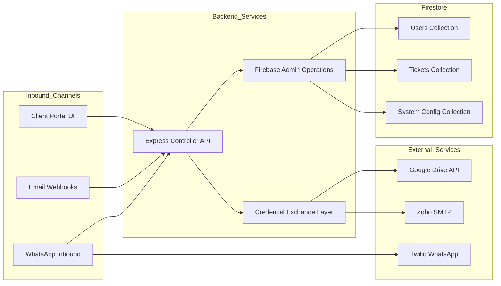
```mermaid
flowchart LR

    subgraph Inbound_Channels
        A[WhatsApp Inbound]
        B[Email Webhooks]
        C[Client Portal UI]
    end

    A --> D[Express Controller API]
    B --> D
    C --> D

    subgraph Backend_Services
        D
        E[Firebase Admin Operations]
        F[Credential Exchange Layer]
    end

    D --> E
    D --> F

    subgraph Firestore
        G[Users Collection]
        H[Tickets Collection]
        I[System Config Collection]
    end

    E --> G
    E --> H
    E --> I

    subgraph External_Services
        J[Google Drive API]
        K[Zoho SMTP]
        L[Twilio WhatsApp]
    end

    F --> J
    F --> K
    A --> L
```

---

# 🧭 2. Ticket Lifecycle Workflow

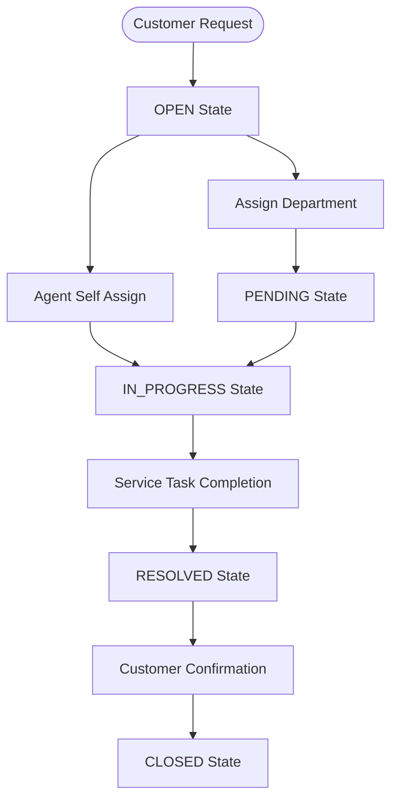
```mermaid
flowchart TD

    A([Customer Request])

    B[OPEN State]

    C[Assign Department]

    D[PENDING State]

    E[Agent Self Assign]

    F[IN_PROGRESS State]

    G[Service Task Completion]

    H[RESOLVED State]

    I[Customer Confirmation]

    J[CLOSED State]

    A --> B

    B --> C --> D

    B --> E --> F

    D --> F

    F --> G --> H --> I --> J
```

---

# ⏱️ 3. SLA Priority Calculation Workflow

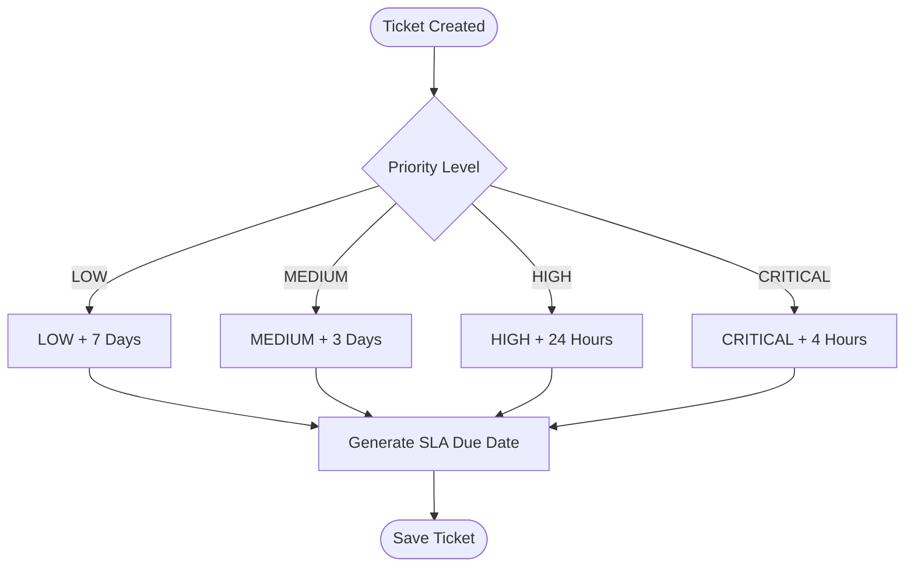
```mermaid
flowchart TD

    A([Ticket Created])

    B{Priority Level}

    C[LOW + 7 Days]

    D[MEDIUM + 3 Days]

    E[HIGH + 24 Hours]

    F[CRITICAL + 4 Hours]

    G[Generate SLA Due Date]

    H([Save Ticket])

    A --> B

    B -- LOW --> C
    B -- MEDIUM --> D
    B -- HIGH --> E
    B -- CRITICAL --> F

    C --> G
    D --> G
    E --> G
    F --> G

    G --> H
```

---

# 🔐 4. RBAC Security Validation Workflow

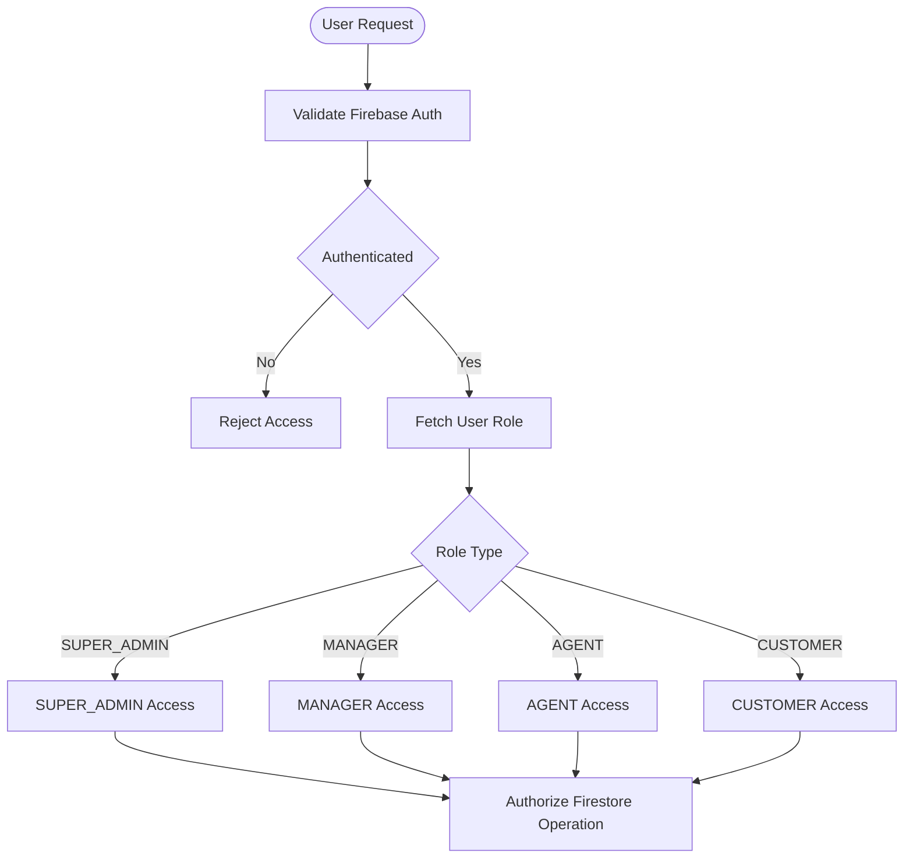
```mermaid
flowchart TD

    A([User Request])

    B[Validate Firebase Auth]

    C{Authenticated}

    D[Reject Access]

    E[Fetch User Role]

    F{Role Type}

    G[SUPER_ADMIN Access]

    H[MANAGER Access]

    I[AGENT Access]

    J[CUSTOMER Access]

    K[Authorize Firestore Operation]

    A --> B --> C

    C -- No --> D

    C -- Yes --> E --> F

    F -- SUPER_ADMIN --> G
    F -- MANAGER --> H
    F -- AGENT --> I
    F -- CUSTOMER --> J

    G --> K
    H --> K
    I --> K
    J --> K
```

---

# 📤 5. Google Drive Upload Workflow

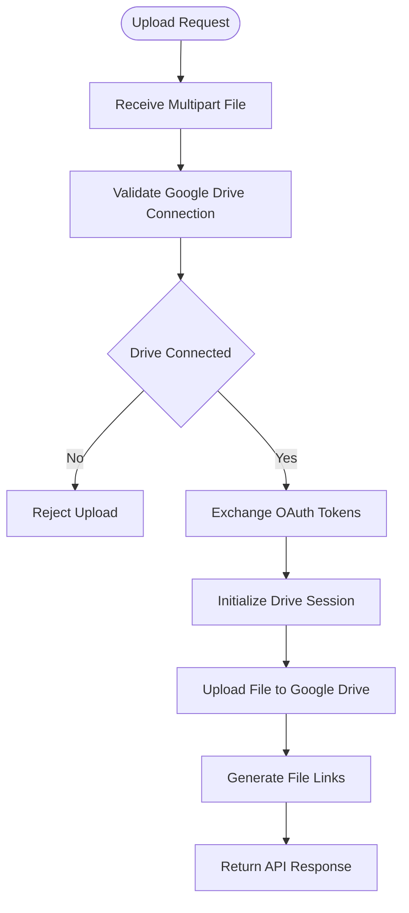
```mermaid
flowchart TD

    A([Upload Request])

    B[Receive Multipart File]

    C[Validate Google Drive Connection]

    D{Drive Connected}

    E[Reject Upload]

    F[Exchange OAuth Tokens]

    G[Initialize Drive Session]

    H[Upload File to Google Drive]

    I[Generate File Links]

    J[Return API Response]

    A --> B --> C --> D

    D -- No --> E

    D -- Yes --> F --> G --> H --> I --> J
```

---

# 📧 6. SMTP Notification Workflow

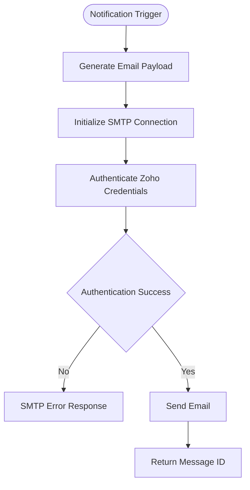
```mermaid
flowchart TD

    A([Notification Trigger])

    B[Generate Email Payload]

    C[Initialize SMTP Connection]

    D[Authenticate Zoho Credentials]

    E{Authentication Success}

    F[SMTP Error Response]

    G[Send Email]

    H[Return Message ID]

    A --> B --> C --> D --> E

    E -- No --> F

    E -- Yes --> G --> H
```

---

# 📲 7. WhatsApp Ticket Ingestion Workflow

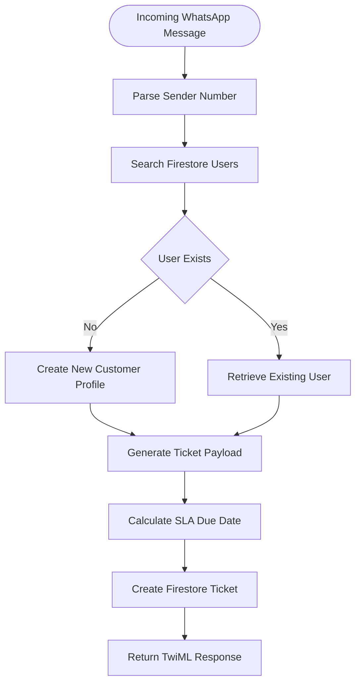
```mermaid
flowchart TD

    A([Incoming WhatsApp Message])

    B[Parse Sender Number]

    C[Search Firestore Users]

    D{User Exists}

    E[Create New Customer Profile]

    F[Retrieve Existing User]

    G[Generate Ticket Payload]

    H[Calculate SLA Due Date]

    I[Create Firestore Ticket]

    J[Return TwiML Response]

    A --> B --> C --> D

    D -- No --> E --> G

    D -- Yes --> F --> G

    G --> H --> I --> J
```

---

# 👥 8. User Creation Workflow

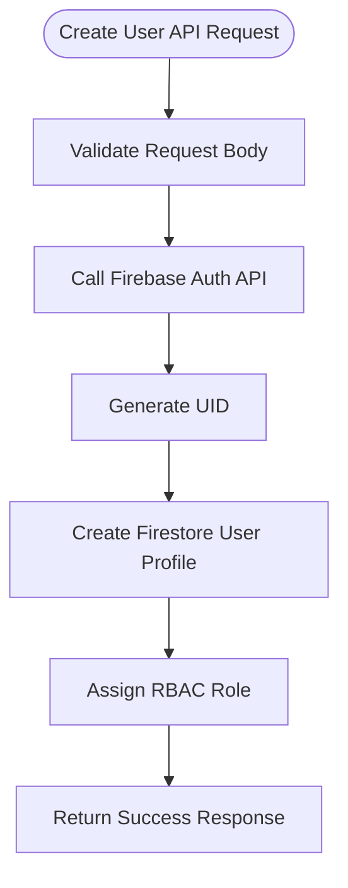
```mermaid
flowchart TD

    A([Create User API Request])

    B[Validate Request Body]

    C[Call Firebase Auth API]

    D[Generate UID]

    E[Create Firestore User Profile]

    F[Assign RBAC Role]

    G[Return Success Response]

    A --> B --> C --> D --> E --> F --> G
```

---

# 🧮 9. Real-Time Actual Operational Expenditure Workflow

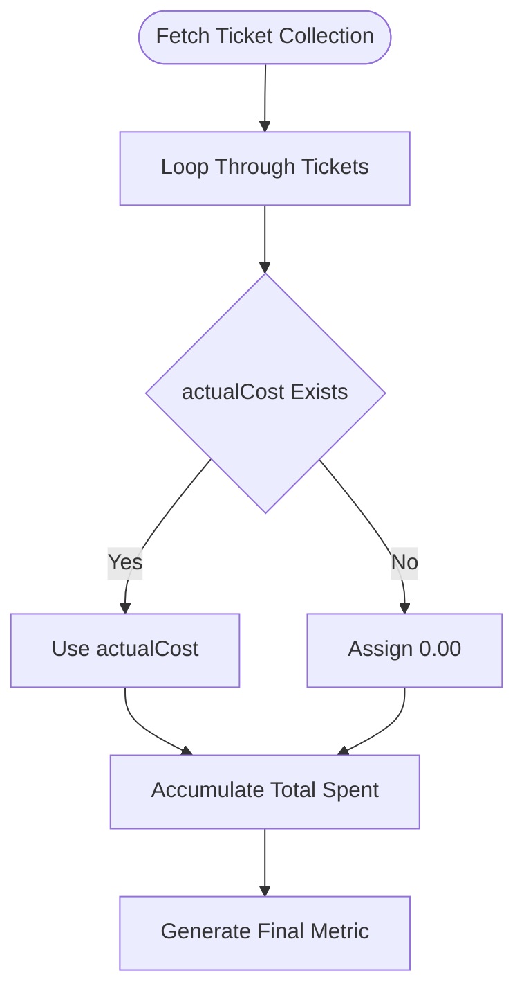
```mermaid
flowchart TD

    A([Fetch Ticket Collection])

    B[Loop Through Tickets]

    C{actualCost Exists}

    D[Use actualCost]

    E[Assign 0.00]

    F[Accumulate Total Spent]

    G[Generate Final Metric]

    A --> B --> C

    C -- Yes --> D --> F

    C -- No --> E --> F

    F --> G
```

---

# 📊 10. Dynamic Capital Utilization Efficiency Workflow

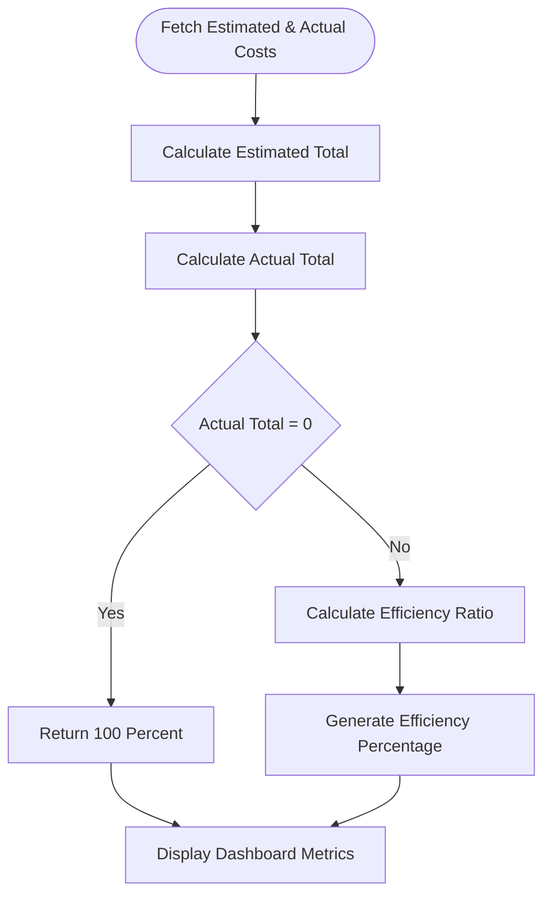
```mermaid
flowchart TD

    A([Fetch Estimated & Actual Costs])

    B[Calculate Estimated Total]

    C[Calculate Actual Total]

    D{Actual Total = 0}

    E[Return 100 Percent]

    F[Calculate Efficiency Ratio]

    G[Generate Efficiency Percentage]

    H[Display Dashboard Metrics]

    A --> B --> C --> D

    D -- Yes --> E --> H

    D -- No --> F --> G --> H
```

---

# 🔁 11. Post-Launch SLA Integrity Notification Engine

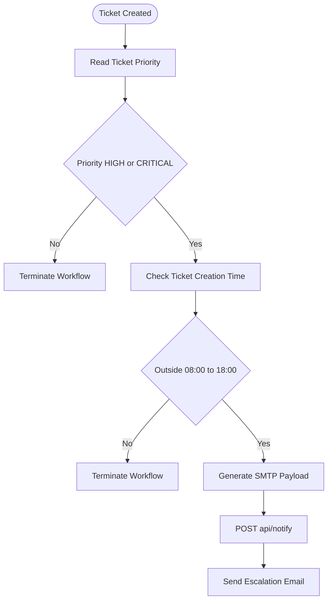
```mermaid
flowchart TD

    A([Ticket Created])

    B[Read Ticket Priority]

    C{Priority HIGH or CRITICAL}

    D[Terminate Workflow]

    E[Check Ticket Creation Time]

    F{Outside 08:00 to 18:00}

    G[Terminate Workflow]

    H[Generate SMTP Payload]

    I[POST api/notify]

    J[Send Escalation Email]

    A --> B --> C

    C -- No --> D

    C -- Yes --> E --> F

    F -- No --> G

    F -- Yes --> H --> I --> J
```

---

# 🔄 12. Escalation & Dynamic Delay Adjustment Monitor

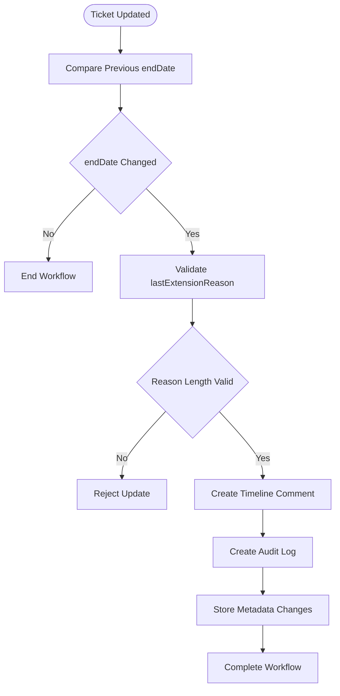
```mermaid
flowchart TD

    A([Ticket Updated])

    B[Compare Previous endDate]

    C{endDate Changed}

    D[End Workflow]

    E[Validate lastExtensionReason]

    F{Reason Length Valid}

    G[Reject Update]

    H[Create Timeline Comment]

    I[Create Audit Log]

    J[Store Metadata Changes]

    K[Complete Workflow]

    A --> B --> C

    C -- No --> D

    C -- Yes --> E --> F

    F -- No --> G

    F -- Yes --> H --> I --> J --> K
```

---

# 🗄️ 13. Firestore Database Relationship Diagram

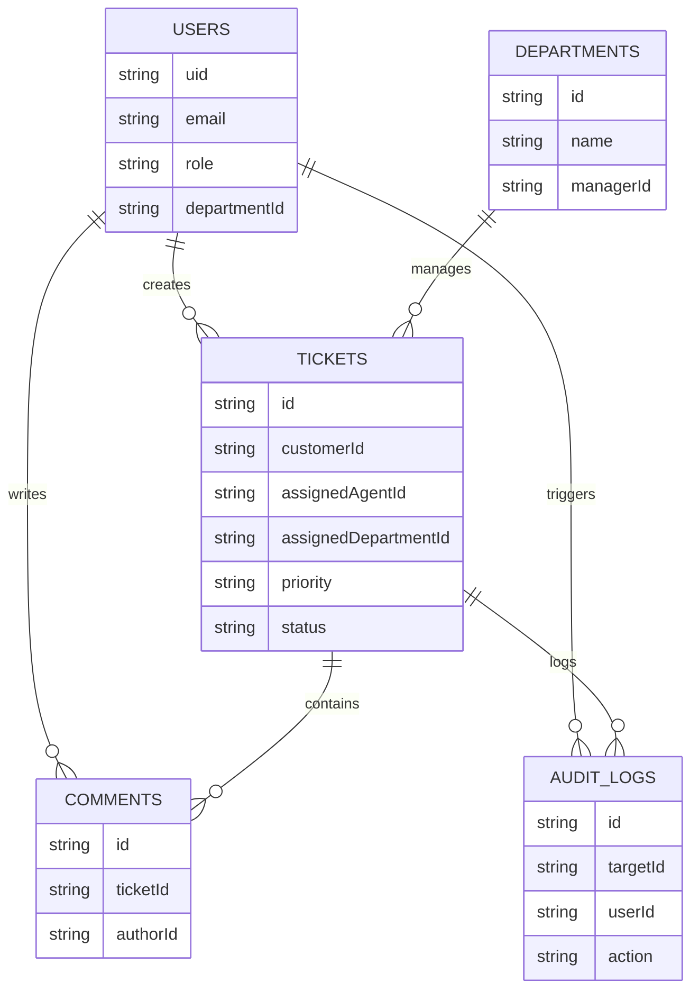
```mermaid
erDiagram

    USERS {
        string uid
        string email
        string role
        string departmentId
    }

    DEPARTMENTS {
        string id
        string name
        string managerId
    }

    TICKETS {
        string id
        string customerId
        string assignedAgentId
        string assignedDepartmentId
        string priority
        string status
    }

    COMMENTS {
        string id
        string ticketId
        string authorId
    }

    AUDIT_LOGS {
        string id
        string targetId
        string userId
        string action
    }

    USERS ||--o{ TICKETS : creates

    USERS ||--o{ COMMENTS : writes

    USERS ||--o{ AUDIT_LOGS : triggers

    DEPARTMENTS ||--o{ TICKETS : manages

    TICKETS ||--o{ COMMENTS : contains

    TICKETS ||--o{ AUDIT_LOGS : logs
```

---

# 📡 14. Complete Enterprise Event Flow

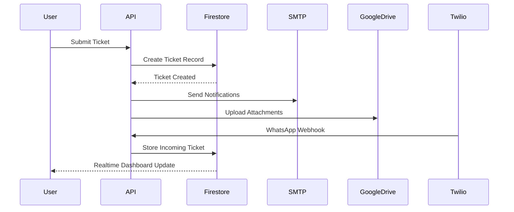
```mermaid
sequenceDiagram

    participant User
    participant API
    participant Firestore
    participant SMTP
    participant GoogleDrive
    participant Twilio

    User->>API: Submit Ticket

    API->>Firestore: Create Ticket Record

    Firestore-->>API: Ticket Created

    API->>SMTP: Send Notifications

    API->>GoogleDrive: Upload Attachments

    Twilio->>API: WhatsApp Webhook

    API->>Firestore: Store Incoming Ticket

    Firestore-->>User: Realtime Dashboard Update
```
---

# 🔐 15. Role-Based Access Control (RBAC) & Security Schemas

## Purpose

This section provides the exact production-ready Cloud Firestore Security Rules (`firestore.rules`) used to enforce secure role-based access control across the enterprise support platform.

## Workflow Utility

- Ensures only authenticated users access protected resources
- Restricts customers to viewing only their own tickets
- Allows agents to modify assigned tickets only
- Enables managers and admins to access operational metrics
- Protects Firestore collections using production-grade RBAC enforcement

---

## RBAC Security Validation Workflow

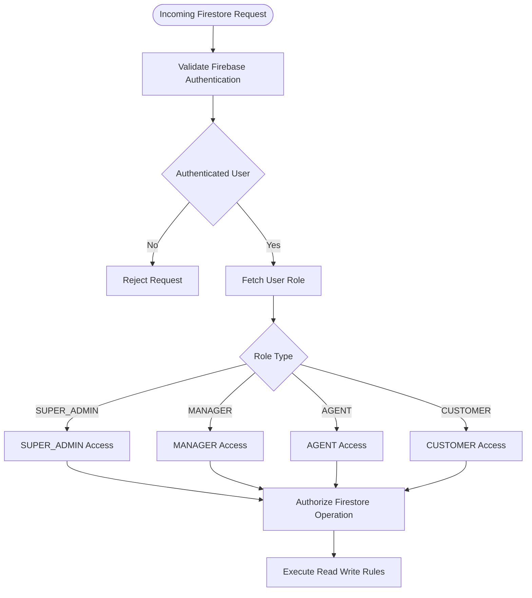
```mermaid
flowchart TD

    A([Incoming Firestore Request])

    B[Validate Firebase Authentication]

    C{Authenticated User}

    D[Reject Request]

    E[Fetch User Role]

    F{Role Type}

    G[SUPER_ADMIN Access]

    H[MANAGER Access]

    I[AGENT Access]

    J[CUSTOMER Access]

    K[Authorize Firestore Operation]

    L[Execute Read Write Rules]

    A --> B --> C

    C -- No --> D

    C -- Yes --> E --> F

    F -- SUPER_ADMIN --> G
    F -- MANAGER --> H
    F -- AGENT --> I
    F -- CUSTOMER --> J

    G --> K
    H --> K
    I --> K
    J --> K

    K --> L
```

---

## Firestore Security Enforcement Layers

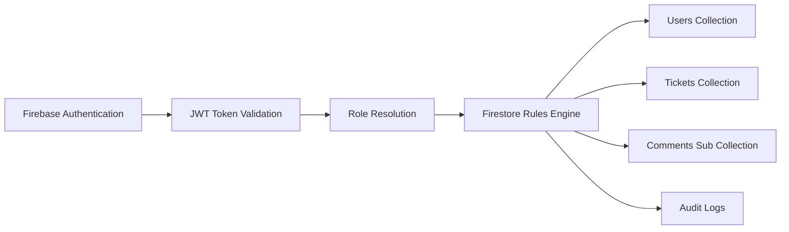
```mermaid
flowchart LR

    A[Firebase Authentication]

    B[JWT Token Validation]

    C[Role Resolution]

    D[Firestore Rules Engine]

    E[Users Collection]

    F[Tickets Collection]

    G[Comments Sub Collection]

    H[Audit Logs]

    A --> B --> C --> D

    D --> E
    D --> F
    D --> G
    D --> H
```

---

# 🧮 16. Analytical Formulations & Mathematical Invariants

## Purpose

Defines enterprise-grade mathematical operations and analytical invariants used for operational dashboards, cost monitoring, and financial efficiency tracking.

---

## Workflow Utility

- Supports custom calculation functions in:
  - n8n
  - Zapier
  - Make.com
  - Node.js middleware
- Maintains dashboard metric consistency
- Enables realtime expenditure analytics
- Supports efficiency and optimization reporting

---

# A. Real-Time Actual Operational Expenditure

## Formula

```math
TotalSpent = Σ(actualCost_i)
```

---

## Expenditure Calculation Workflow

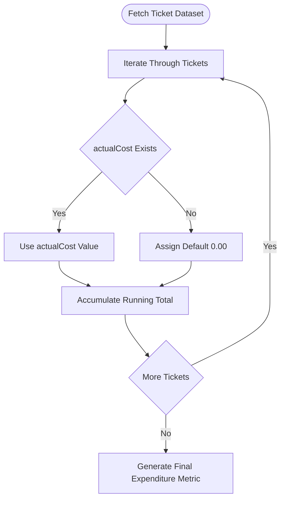
```mermaid
flowchart TD

    A([Fetch Ticket Dataset])

    B[Iterate Through Tickets]

    C{actualCost Exists}

    D[Use actualCost Value]

    E[Assign Default 0.00]

    F[Accumulate Running Total]

    G{More Tickets}

    H[Generate Final Expenditure Metric]

    A --> B --> C

    C -- Yes --> D --> F

    C -- No --> E --> F

    F --> G

    G -- Yes --> B

    G -- No --> H
```

---

## Missing Value Handling Logic

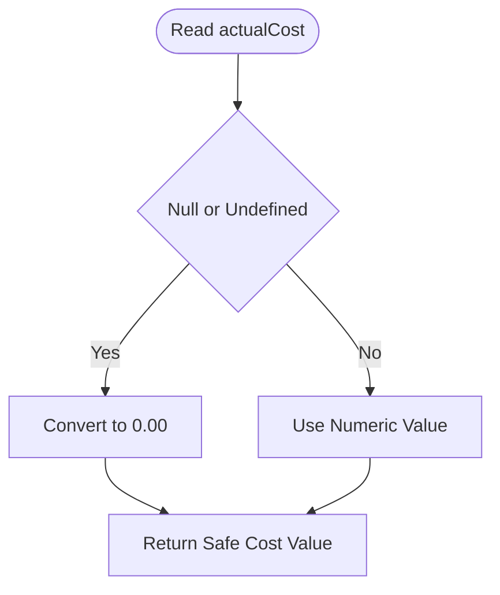
```mermaid
flowchart TD

    A([Read actualCost])

    B{Null or Undefined}

    C[Convert to 0.00]

    D[Use Numeric Value]

    E[Return Safe Cost Value]

    A --> B

    B -- Yes --> C --> E

    B -- No --> D --> E
```

---

# B. Dynamic Capital Utilization Efficiency

## Formula

```math
Efficiency % = (Estimated Total / Actual Total) * 100
```

---

## Efficiency Vector Workflow

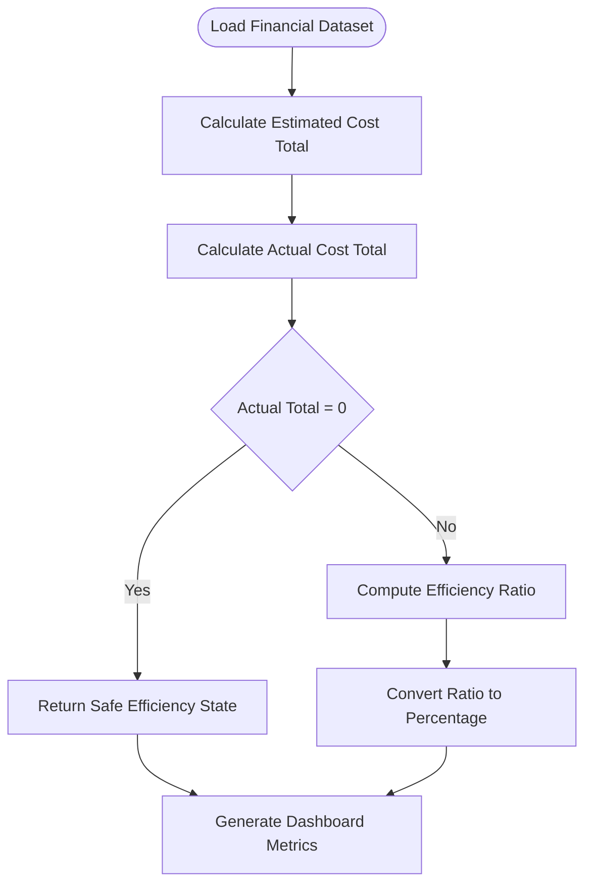
```mermaid
flowchart TD

    A([Load Financial Dataset])

    B[Calculate Estimated Cost Total]

    C[Calculate Actual Cost Total]

    D{Actual Total = 0}

    E[Return Safe Efficiency State]

    F[Compute Efficiency Ratio]

    G[Convert Ratio to Percentage]

    H[Generate Dashboard Metrics]

    A --> B --> C --> D

    D -- Yes --> E --> H

    D -- No --> F --> G --> H
```

---

## Cost Optimization Decision Workflow

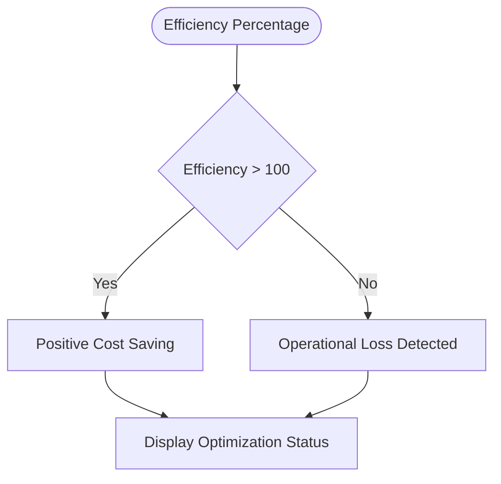
```mermaid
flowchart TD

    A([Efficiency Percentage])

    B{Efficiency > 100}

    C[Positive Cost Saving]

    D[Operational Loss Detected]

    E[Display Optimization Status]

    A --> B

    B -- Yes --> C --> E

    B -- No --> D --> E
```

---

# 🔁 17. Workflow Automation Recipes

## Purpose

Provides enterprise automation recipes and integration workflows for:
- n8n
- Zapier
- Make.com
- Enterprise orchestration systems

---

# Recipe A — Post-Launch SLA Integrity Notification Engine

## Purpose

Triggers automatic escalation notifications whenever HIGH or CRITICAL tickets are generated outside operational working hours.

---

## SLA Integrity Notification Workflow

```mermaid
flowchart TD

    A([Ticket Creation Event])

    B[Read Priority & createdAt]

    C{Priority HIGH or CRITICAL}

    D[Terminate Workflow]

    E[Convert UTC to Local Time]

    F{Outside 08:00 to 18:00}

    G[End Without Escalation]

    H[Generate SMTP Alert Payload]

    I[POST api/notify]

    J[Send Zoho SMTP Escalation]

    K[Store Escalation Audit Log]

    A --> B --> C

    C -- No --> D

    C -- Yes --> E --> F

    F -- No --> G

    F -- Yes --> H --> I --> J --> K
```

---

## External Automation Architecture

```mermaid
flowchart LR

    A[Firestore Ticket Trigger]

    B[n8n or Zapier Workflow]

    C[Priority Validation]

    D[Business Hour Filter]

    E[SMTP Payload Generator]

    F[api/notify Endpoint]

    G[Zoho SMTP]

    H[Management Escalation Email]

    A --> B --> C --> D --> E --> F --> G --> H
```

---

# Recipe B — Escalation & Dynamic Delay Adjustment Monitor

## Purpose

Monitors deadline modifications and automatically creates audit trails, timeline comments, and escalation logs whenever managers extend target resolution dates.

---

## Deadline Extension Monitoring Workflow

```mermaid
flowchart TD

    A([Ticket Update Event])

    B[Compare Previous endDate]

    C{endDate Modified}

    D[Terminate Workflow]

    E[Validate lastExtensionReason]

    F{Reason Exists}

    G[Reject Update]

    H[Generate Markdown Audit Comment]

    I[Create Comment Document]

    J[Create Audit Log Entry]

    K[Store Metadata Changes]

    L[Complete Workflow]

    A --> B --> C

    C -- No --> D

    C -- Yes --> E --> F

    F -- No --> G

    F -- Yes --> H --> I --> J --> K --> L
```

---

## Audit Logging Pipeline

```mermaid
flowchart LR

    A[Manager Updates endDate]

    B[Firestore Trigger]

    C[Validate Reason]

    D[Generate Timeline Comment]

    E[Write Comments Sub Collection]

    F[Generate Metadata Object]

    G[Write AuditLogs Sub Collection]

    H[Realtime Dashboard Sync]

    A --> B --> C --> D --> E --> F --> G --> H
```

---

# End of Advanced Workflow Extensions
---
